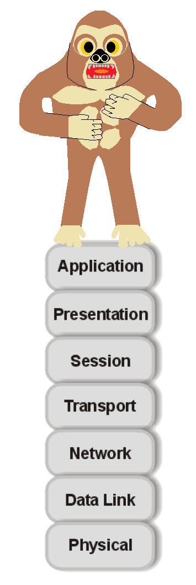

# backEndFriend51.github.io

 

 

	

## ueber mich
	
Mein Name ist Rainer Stöhr, ich wurde 
 am 17. Mai 1983 geboren und wohne in München.
Seit meinem 6. Lebensjahr bin ich koerperbehindert 
 und auf einen Rollstuhl angewiesen.
Trotz meiner Koerperbehinderung konnte ich 
 die Schule und das Studium der Informatik absolvieren,
sowie 2018 den Abschluss als Bachelor zu erlangen.
	
Nach dem Fachabitur habe ich gemerkt, dass ich Informatik  
studieren möchte. Das Studium habe ich an der Hochschule München 
aufgenommen und im Verlauf des Studiums die Vertiefungsfächer 
Datenschutz und IT- Sicherheit, Datenbanksysteme sowie Netzwerke belegt.
Im Oktober 2015 habe ich, während meinem praktischem Studiensemesters, 
ein erstes Praktikum begonnen. Bei der iSYS Software GmbH war es mir 
möglich Erfahrungen zu den einzelnen Phasen eines 
Softwareprojektes zu sammeln. Nach meinem Studium 
habe ich unter anderem Online- Zertifikate 
in HTML & CSS sowie in PHP gemacht.

 

My top Languages

		
| Rank | Languages     |
|-----:|---------------|
|     1|    Java       |
|     2|   HTML/CSS    |
|     3|     C++       |
	

 
---
	
